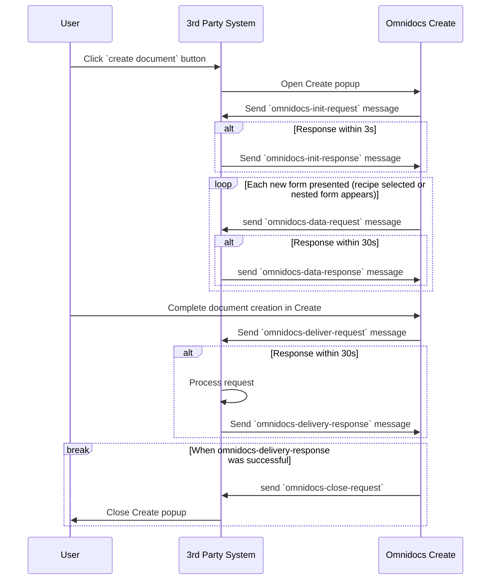
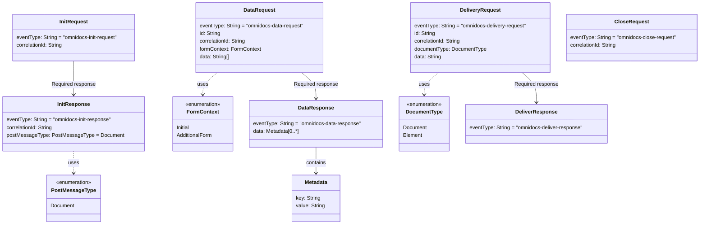

# Omnidocs App Flow
This application, the Omnidocs App Flow, facilitates the integration of the Omnidocs Platform with third-party applications, enabling seamless access and interaction within commonly utilized workplace applications to foster efficient and supportive workflows.

This integration operates solely within the browser environment, utilizing the JavaScript PostMessage API. Consequently, there is no network interaction required between Omnidocs Platform and the integrating system. Theoretically, this allows the integration to function with systems that are not accessible via the internet.

Key functionalities provided by the App Flow include:
1. Accessing content stored on the Omnidocs Platform.
2. Generating assets derived from submitted form data and user identity information.
3. Enhancing forms with data sourced from third-party systems.

## Prerequisites
1. The App Flow must be hosted on HTTPS to ensure information security.
2. The third-party application must support hosting custom components and utilize JavaScript.
3. The third-party application must be capable of opening pop-ups and utilizing the PostMessage API.

## How it works?
The integration works by interacting with Omnidocs Platform using messages via the PostMessage API, those messages and the user flow is describe in following steps:

1. <b>User Action</b>: The user initiates the process by clicking the "Create Document" button in the third-party system.
2. <b>Popup Initiation</b>: Subsequently, the third-party system opens a popup for the Omnidocs Platform.
3. <b>Initialization</b>: The Omnidocs Platform sends an <b>'omnidocs-init-request'</b> message, to which the third-party system must respond with an <b>'omnidocs-init-response'</b> within three seconds.
4. <b>Data Requests</b>: As new forms are presented, the Omnidocs Platform dispatches <b>'omnidocs-data-request'</b> messages. The third-party system is required to reply with <b>'omnidocs-data-response'</b> messages within 30 seconds, potentially including data.
5. <b>Document Creation</b>: After the user fills out the form and clicks the Platform button, the Omnidocs Platform sends an <b>'omnidocs-delivery-request'</b> message.
6. <b>Document Processing</b>: The third-party system processes the document and issues an <b>'omnidocs-deliver-response'</b>.
7. <b>Completion</b>: Upon receiving a successful response, the Omnidocs Platform transmits an <b>'omnidocs-close-request'</b>, prompting the third-party system to close the popup.

### Sequence Diagram


### Class diagrams


### Breakdown 
- In the InitResponse (<i>omnidocs-init-response</i>), the client specifies which PostMessageType it wants. If <b>Document</b> is set (which is the default), then the DeliveryRequest (<i>omnidocs-delivery-request</i>) data will contain the document download URL.
- The data field in DataRequest (<i>omnidocs-data-request</i>) contains the form keys from the recipe. 
- The formContext field in DataRequest (<i>omnidocs-data-request</i>) indicates the recipe context. <b>Initial</b> is the initially selected recipe, and <b>AdditionalForm</b> is the nested form.
- The id field in all events is the recipe id, with one exception: if the DataRequest (<i>omnidocs-data-request</i>) form context is <b>AdditionalForm</b>, then it is the nested form ID that gets shown.
- The correlationId is used for logging and traceability purposes.
    - Omnidocs Create provides a correlationId in the InitRequest (<i>omnidocs-init-request</i>), which can be used in the client's InitResponse (<i>omnidocs-init-response</i>). This correlationId will then be included in every subsequent requests from Omnidocs Create.
- The data field in DataResponse (<i>omnidocs-data-response</i>) containing the Metadata array of key-value pairs is represented by "key" = formKey and "value" = text to be added to that form.
    - The data field can be omitted.
- The documentType in the DeliveryRequest (<i>omnidocs-delivery-request</i>) indicates the type of document created. <b>Document</b> is the full document, and <b>Element</b> is a partial document.

### How to use the example application
1. Create a new integration of type Post Message under Integrations in your Omnidocs Platform unit. 
2. Clone this repository.
3. Set subdomain and domain to match your Omnidocs Platform tenant.
4. Utilize the integrationId from the integration outlined in step 1, along with the unit id corresponding to the Omnidocs Platform space. Make the necessary edits within the index.html file of the example application by updating the value: `<input id="popup-url" className="input" type="text" size="100" value="https://{YOUR-SUB-DOMAIN}.{YOUR-DOMAIN}/units/{YOUR-UNIT-ID}/documents?integrationId={YOUR-INTEGRATION-ID}"/>`
5. In the folder containing the downloaded repository, run the following command: `npm i && npm start` 
6. Navigate to `http://localhost:8080` to interact with this example App Flow app.
7. Complete the document generation process. 
8. The document can be accessed by opening the downloaded document url. 

### JS example
```
// Required Client responses
const initResponse = {
  eventType: 'omnidocs-init-response',
  correlationId: '4B8C1909-9B9E-4EE3-AC1B-6FDB4C5A2C42',
  postMessageType: 'Document'
};

const dataResponse = {
  eventType: 'omnidocs-data-response',
  data: [{ 'formkey': 'formValue' }, { 'formkey2': 'formValue2' }] // Optional 
};

const deliverResponse = {
  eventType: 'omnidocs-deliver-response'
};

// Omnidocs requests
const initRequest = {
  eventType: 'omnidocs-init-request',
  correlationId: '4B8C1909-9B9E-4EE3-AC1B-6FDB4C5A2C42',
};

const dataRequest = {
  eventType: 'omnidocs-data-request',
  id: '66a0b249d24875aa6326228c',
  correlationId: '4B8C1909-9B9E-4EE3-AC1B-6FDB4C5A2C42',
  formContext: 'Initial', // or AdditionalForm
  data: ['formkey', 'formkey2']
};

const deliveryRequest = {
  eventType: 'omnidocs-delivery-request',
  id: '66a0b249d24875aa6326228c',
  correlationId: '4B8C1909-9B9E-4EE3-AC1B-6FDB4C5A2C42',
  documentType: 'Document', // or Element 
  data: 'DownloadUrl'
};

const closeRequest = {
  eventType: 'omnidocs-close-request',
  correlationId: '4B8C1909-9B9E-4EE3-AC1B-6FDB4C5A2C42',
};
```

### References 
Window postMessage: https://developer.mozilla.org/en-US/docs/Web/API/Window/postMessage
