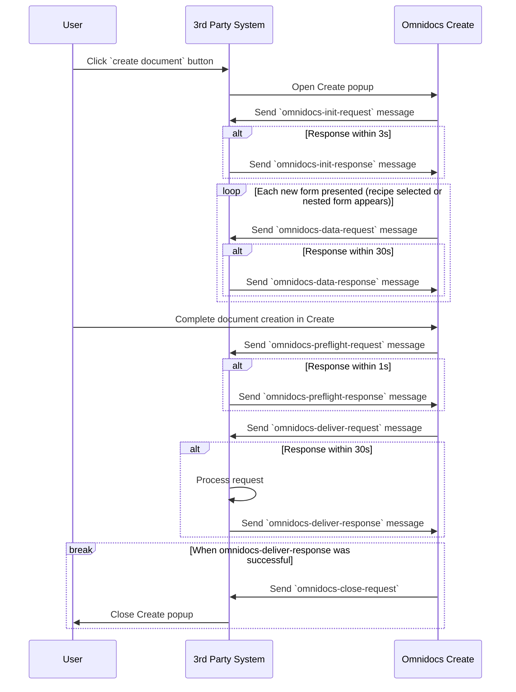

# Omnidocs App Flow
This application, the Omnidocs App Flow, facilitates the integration of the Omnidocs Platform with third-party applications, enabling seamless access and interaction within commonly utilized workplace applications to foster efficient and supportive workflows.

This integration operates solely within the browser environment, utilizing the JavaScript PostMessage API. Consequently, there is no network interaction required between Omnidocs Platform and the integrating system. Theoretically, this allows the integration to function with systems that are not accessible via the internet.

Key functionalities provided by the App Flow include:
1. Accessing content stored on the Omnidocs Platform.
2. Generating assets derived from submitted form data and user identity information.
3. Enhancing forms with data sourced from third-party systems.
4. Opening Omnidocs Edit Flow with provided config before downloading your document

## Prerequisites
1. The App Flow must be hosted on HTTPS to ensure information security.
2. The third-party application must support hosting custom components and utilize JavaScript.
3. The third-party application must be capable of opening pop-ups and utilizing the PostMessage API.

## How it works?
The integration works by interacting with Omnidocs Platform using messages via the PostMessage API, those messages and the user flow is describe in following steps:

1. <b>User Action</b>: The user initiates the process by clicking the "Create Document" button in the third-party system.
2. <b>Popup Initiation</b>: Subsequently, the third-party system opens a popup for the Omnidocs Platform.
3. <b>Initialization</b>: The Omnidocs Platform sends an <b>'omnidocs-init-request'</b> message, to which the third-party system must respond with an <b>'omnidocs-init-response'</b> within three seconds. Here it is also possible to send a EditFlowConfiguration along with the omnidocs-init-response. The configuration possibilities can be read in EditFlow documentation and is simply forwarded from App Flow if enabled. This allows you to open edit flow before you download the generated document, edit it and get the edited document served afterwards.
4. <b>Data Requests</b>: As new forms are presented, the Omnidocs Platform dispatches <b>'omnidocs-data-request'</b> messages. The third-party system is required to reply with <b>'omnidocs-data-response'</b> messages within 30 seconds, potentially including data.
5. <b>Document Creation</b>: After the user fills out the form and clicks the Platform button, the Omnidocs Platform sends an <b>'omnidocs-deliver-request'</b> message.
6. <b>Document Processing</b>: The third-party system processes the document and issues an <b>'omnidocs-deliver-response'</b>.
7. <b>Completion</b>: Upon receiving a successful response, the Omnidocs Platform transmits an <b>'omnidocs-close-request'</b>, prompting the third-party system to close the popup.

### Sequence Diagram

```mermaid
sequenceDiagram
    participant User as User
    participant 3rd as 3rd Party System
    participant OC as Omnidocs Create

    User->> 3rd: Click `create document` button
    3rd->> OC: Open Create popup
    OC->> 3rd: Send `omnidocs-init-request` message
    
    alt Response within 3s
    3rd->> OC: Send `omnidocs-init-response` message
    end
    
    loop Each new form presented (recipe selected or nested form appears)
        OC ->> 3rd: Send `omnidocs-data-request` message
        alt Response within 30s
            3rd ->> OC: Send `omnidocs-data-response` message
        end
    end

    User->>OC: Complete document creation in Create

    %% Preflight request and response before deliver request
    OC->>3rd: Send `omnidocs-preflight-request` message
    alt Response within 1s
        3rd->>OC: Send `omnidocs-preflight-response` message
    end

    %% deliver request after preflight check
    OC->>3rd: Send `omnidocs-deliver-request` message

    alt Response within 30s
        3rd->>3rd: Process request
        3rd->>OC: Send `omnidocs-deliver-response` message
    end

    break When omnidocs-deliver-response was successful
        OC ->> 3rd: Send `omnidocs-close-request`
        3rd->>User: Close Create popup
    end
```

### Class diagrams
```mermaid
classDiagram
    class InitRequest {
        eventType: String = "omnidocs-init-request"
        correlationId: String
    }

    class InitResponse {
        eventType: String = "omnidocs-init-response"
        correlationId: String
        postMessageType: PostMessageType = Document
        editBeforeDelivery: Boolean = false
        editFlowConfiguration: {}
    }

    class PostMessageType {
        <<enumeration>>
        Document
    }

    class DataRequest {
        eventType: String = "omnidocs-data-request"
        id: String
        correlationId: String
        formContext: FormContext
        data: String[]
    }

    class PreflightRequest {
        eventType: String = "omnidocs-preflight-request"
        correlationId: String
    }

    class PreflightResponse {
        eventType: String = "omnidocs-preflight-response"
        data: PreflightData
    }

    class PreflightData {
        getPdf: Boolean = false
    }

    class FormContext {
        <<enumeration>>
        Initial
        AdditionalForm
    }

    class DataResponse {
        eventType: String = "omnidocs-data-response"
        data: Metadata[]
    }

    class Metadata {
        key: String
        value: String
    }

    class DeliverRequest {
        eventType: String = "omnidocs-deliver-request"
        id: String
        correlationId: String
        documentType: DocumentType
        data: String
    }

    class DocumentType {
        <<enumeration>>
        Document
        Element
    }

    class DeliverResponse {
        eventType: String = "omnidocs-deliver-response"
    }

    class CloseRequest {
        eventType: String = "omnidocs-close-request"
        correlationId: String
    }

    %% Relationships
    InitRequest --> InitResponse : Required response
    DataRequest --> DataResponse : Required response
    DeliverRequest --> DeliverResponse : Required response
    PreflightRequest --> PreflightResponse : Optional response
    PreflightResponse ..> PreflightData : contains
    DataResponse --> Metadata : contains
    InitResponse ..> PostMessageType : uses
    DataRequest ..> FormContext : uses
    DeliverRequest ..> DocumentType : uses
```

### Breakdown 
- In the InitResponse (<i>omnidocs-init-response</i>), the client specifies which PostMessageType it wants. If <b>Document</b> is set (which is the default), then the deliverRequest (<i>omnidocs-deliver-request</i>) data will contain the document download URL.
- The data field in DataRequest (<i>omnidocs-data-request</i>) contains the form keys from the recipe. 
- The formContext field in DataRequest (<i>omnidocs-data-request</i>) indicates the recipe context. <b>Initial</b> is the initially selected recipe, and <b>AdditionalForm</b> is the nested form.
- The id field in all events is the recipe id, with one exception: if the DataRequest (<i>omnidocs-data-request</i>) form context is <b>AdditionalForm</b>, then it is the nested form ID that gets shown.
- The correlationId is used for logging and traceability purposes.
    - Omnidocs Create provides a correlationId in the InitRequest (<i>omnidocs-init-request</i>), which can be used in the client's InitResponse (<i>omnidocs-init-response</i>). This correlationId will then be included in every subsequent requests from Omnidocs Create.
- The data field in DataResponse (<i>omnidocs-data-response</i>) containing the Metadata array of key-value pairs is represented by "key" = formKey and "value" = text to be added to that form.
    - The data field can be omitted.
    - Be mindful to include "key" and "label" values for entries, when filling in data for Select components and SearchableSelect components.
- The documentType in the deliverRequest (<i>omnidocs-deliver-request</i>) indicates the type of document created. <b>Document</b> is the full document, and <b>Element</b> is a partial document.
- The getPdf in the PreflightResponse (<i>omnidocs-preflight-response</i>) defines whether the deliverResponse (<i>omnidocs-deliver-response</i>) returns a file in a PDF format or defaults to the respective Office file type of the recipe. 
- The "Edit document with EditFlow before delivery" checkbox defines whether Create redirects to EditFlow, allowing the user to edit the generated document before delivery.
    - The editBeforeDelivery field in the InitResponse (<i>omnidocs-init-response</i>) specifies whether EditFlow should be triggered after the document is generated by AppFlow.
### How to use the example application
1. Create a new integration of type Post Message under Integrations in your Omnidocs Platform unit. 
2. Clone this repository.
3. Make the necessary edits within the index.html file of the example application by updating the value shown below. Set subdomain and domain to match your Omnidocs Platform tenant. Utilize the integrationId from the integration outlined in step 1, along with the unit id corresponding to the Omnidocs Platform space.
``` 
<input id="popup-url" className="input" type="text" size="100" value="https://{YOUR-SUB-DOMAIN}.{YOUR-DOMAIN}/units/{YOUR-UNIT-ID}/documents?integrationId={YOUR-INTEGRATION-ID}" /> 
```
4. In the folder containing the downloaded repository, run the following command:
```
npm i && npm start 
```
5. Navigate to http://localhost:8080 to interact with this example App Flow app.
6. Complete the document generation process. 
7. The document can be accessed by opening the downloaded document url. 

### Opening options
Since opening in an iframe is not supported for Single-Sign-On, there are a few options:
#### Popup window
- <b>Flow:</b> Your application opens a popup window to handle authentication and document generation. Once the process is complete, the popup uses the <i>postMessage</i> API to send the resulting data (e.g. a document link) back to the parent application.
- <b>Pros:</b> Keeps the user within the main application, allowing for seamless interaction.
- <b>Cons:</b> Popup blockers might interfere; Limited screen space.
#### New Tab or Window
- <b>Flow:</b> Your application opens a new tab or window. After the authentication and generation process, the new window sends the data back to the original application using the <i>postMessage</i> API.
- <b>Pros:</b> Provides more space for complex interactions; Less likely to be blocked compared to popups.
- <b>Cons:</b> May cause user confusion if multiple tabs are open.

### JS example
```
// Required Client responses
const initResponse = {
  eventType: 'omnidocs-init-response',
  correlationId: '4B8C1909-9B9E-4EE3-AC1B-6FDB4C5A2C42',
  postMessageType: 'Document'
};

const dataResponse = {
  eventType: 'omnidocs-data-response',
  data: [{ 'formkey': 'formValue' }, { 'formkey2': 'formValue2' }] // Optional 
};

const deliverResponse = {
  eventType: 'omnidocs-deliver-response'
};

// Omnidocs requests
const initRequest = {
  eventType: 'omnidocs-init-request',
  correlationId: '4B8C1909-9B9E-4EE3-AC1B-6FDB4C5A2C42',
};

const preflightRequest = {
    eventType: "omnidocs-preflight-request",
    correlationId: '4B8C1909-9B9E-4EE3-AC1B-6FDB4C5A2C42'
};

const preflightResponse = {
    eventType: 'omnidocs-preflight-response',
    data: { getPdf: false }
};

const dataRequest = {
  eventType: 'omnidocs-data-request',
  id: '66a0b249d24875aa6326228c',
  correlationId: '4B8C1909-9B9E-4EE3-AC1B-6FDB4C5A2C42',
  formContext: 'Initial', // or AdditionalForm
  data: ['formkey', 'formkey2']
};

const deliverRequest = {
  eventType: 'omnidocs-deliver-request',
  id: '66a0b249d24875aa6326228c',
  correlationId: '4B8C1909-9B9E-4EE3-AC1B-6FDB4C5A2C42',
  documentType: 'Document', // or Element 
  data: 'DownloadUrl'
};

const closeRequest = {
  eventType: 'omnidocs-close-request',
  correlationId: '4B8C1909-9B9E-4EE3-AC1B-6FDB4C5A2C42',
};
```

### Important notes

#### Origin of 'omnidocs-deliver-response' PostMessage

When handling the <b>'omnidocs-deliver-response'</b> postMessage event, the **origin** of the message depends on whether the **Edit document with EditFlow before delivery** option is enabled.

#### 1. With "Edit document with EditFlow before delivery" Enabled

If the checkbox for **Edit document with EditFlow before delivery** is selected, the message will originate from the following domain: https://prod.wopi.synapseomnidocs.com
This indicates that the document is being processed through the EditFlow environment before it is delivered.

#### 2. With "Edit document with EditFlow before delivery" Disabled

If the checkbox is **not** selected, the message origin will follow the standard delivery flow and originate from a subdomain under `omnidocs.cloud`. The origin will follow the format: https://{subdomain}.omnidocs.cloud

#### Downloading file
When downloading a file using the downloadUrl received in the DeliverResponse, determine the file extension based on the response headers.
You can extract the file extension using one of the following headers:
1. Content-Type header (e.g., application/vnd.openxmlformats-officedocument.wordprocessingml.document for a Word document).
2. Content-Disposition header, which provides the filename and extension in the format:
```
attachment; filename={fileName}.{fileExtension}; filename*=UTF-8''{fileName}.{fileExtension}
```

### References 
Window postMessage: https://developer.mozilla.org/en-US/docs/Web/API/Window/postMessage
